# Guide Utilisateur — Observatoire Hydrologique France

Ce guide décrit l'ensemble des fonctionnalités de la plateforme et comment les utiliser.

---

## Table des matières

1. [Vue d'ensemble](#vue-densemble)
2. [Carte interactive (Observatoire)](#carte-interactive-observatoire)
3. [Panneau de contrôle (volet droit)](#panneau-de-contrôle-volet-droit)
4. [Fiche station (volet gauche)](#fiche-station-volet-gauche)
5. [Détail station](#détail-station)
6. [Timeline historique](#timeline-historique)
7. [Alertes](#alertes)
8. [Comparaison multi-stations](#comparaison-multi-stations)
9. [Recherche universelle](#recherche-universelle)
10. [Système de classification](#système-de-classification)
11. [Indices de sécheresse](#indices-de-sécheresse)
12. [Fiabilité des stations](#fiabilité-des-stations)
13. [Sources de données](#sources-de-données)

---

## Vue d'ensemble

L'Observatoire Hydrologique France est un tableau de bord interactif de surveillance des eaux souterraines (piézométrie) et de surface (hydrométrie) en France métropolitaine. Il permet de :

- Visualiser l'état des nappes et des cours d'eau en temps réel sur une carte interactive
- Suivre l'évolution historique des niveaux via des séries temporelles
- Détecter les situations anormales (sécheresse, crues) grâce au système de classification à 7 classes
- Comparer plusieurs stations entre elles
- Croiser les données hydrologiques avec les données climatiques ERA5

La plateforme est accessible via 4 pages principales, accessibles depuis la barre de navigation en haut :

| Page | Description |
|---|---|
| **Observatoire** | Carte interactive avec toutes les stations et calques |
| **Alertes** | Stations en situation anormale, classées par sévérité |
| **Comparer** | Comparaison multi-stations avec normalisation z-score |
| **À propos** | Informations sur le projet, les sources de données et la méthodologie |

---

## Carte interactive (Observatoire)

La page principale affiche une carte de France avec l'ensemble des stations de mesure.

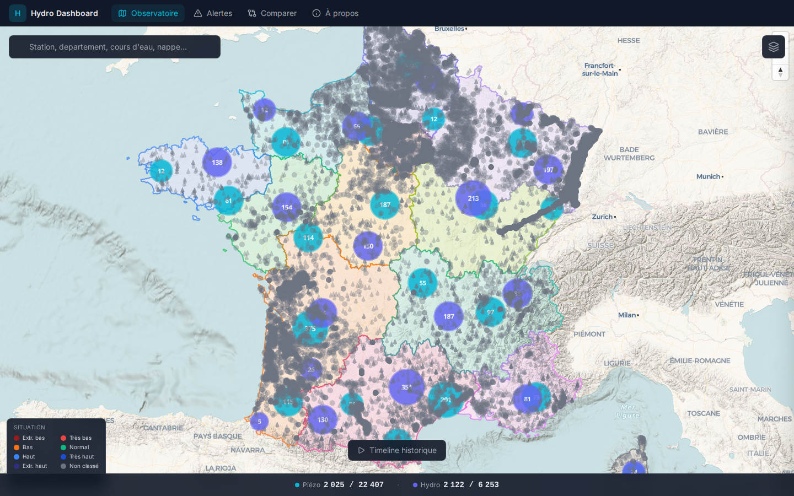

### Panneau de contrôle

Le panneau de contrôle s'ouvre en cliquant sur l'icône de calques (en haut à droite de la carte). Il est organisé en 3 sections repliables : **Données**, **Filtres** et **Calques**.

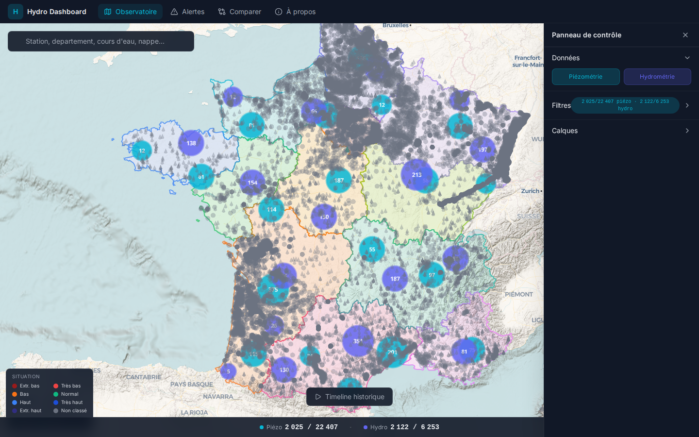

### Stations

Les stations apparaissent sous forme de marqueurs colorés sur la carte :

- **Stations piézométriques (eaux souterraines)** — marqueurs circulaires
- **Stations hydrométriques (eaux de surface)** — marqueurs en forme de goutte

La couleur de chaque marqueur correspond à sa classification actuelle (voir [Système de classification](#système-de-classification)).

### Clusters

À faible niveau de zoom, les stations proches sont regroupées en **clusters** affichant le nombre de stations. Zoomer pour voir les stations individuelles.

### Stations grises (filtrées)

Les marqueurs gris semi-transparents représentent des stations **exclues par les filtres actifs** (fiabilité insuffisante, pas de données récentes, etc.). Ces stations restent visibles pour donner une vue d'ensemble du réseau, mais ne sont pas comptabilisées dans les statistiques. Elles sont cliquables pour consulter leur fiche.

Les stations grises sont **désactivées par défaut** pour accélérer le chargement. Le toggle « Stations filtrées (grises) » dans la section Données du panneau de contrôle permet de les activer.

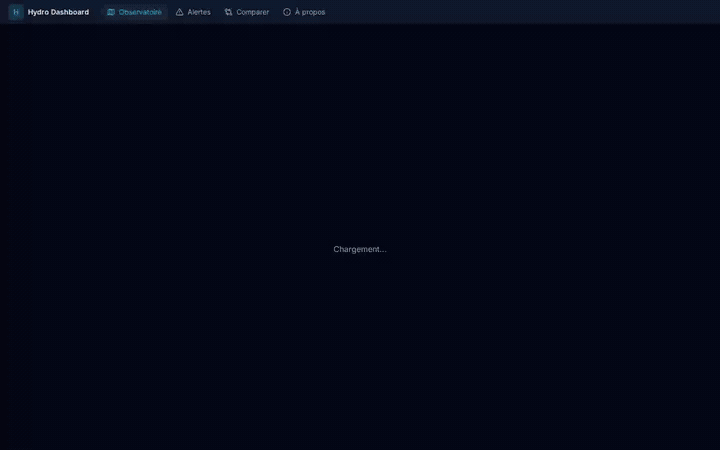

### Calques de fond

La carte propose plusieurs niveaux d'information géographique superposables.

**Calques de zone (exclusifs — un seul actif à la fois) :**

| Calque | Description |
|---|---|
| Régions | 13 régions métropolitaines avec couleurs distinctes |
| Départements | Limites départementales |
| Bassins (SANDRE) | Districts hydrographiques (8 bassins) |
| Hydroécorégions (HER-2) | Zones HER de niveau 2 |
| Régions hydrographiques | Découpage SANDRE niveau 1 |
| Secteurs hydrographiques | Découpage SANDRE niveau 2 (visible à partir du zoom 6) |
| Sous-secteurs hydro. | Découpage SANDRE niveau 3 (visible à partir du zoom 7) |
| Zones hydrographiques | Découpage SANDRE le plus fin (visible à partir du zoom 9) |

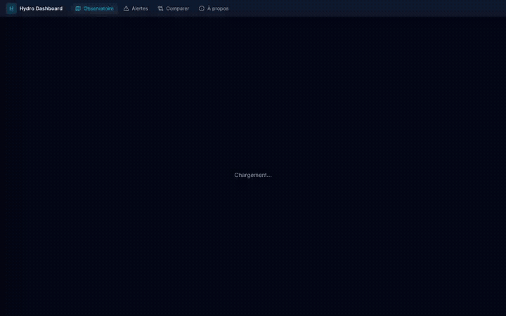

**Calques superposables (combinables librement) :**

| Calque | Description |
|---|---|
| Cours d'eau principaux | Cours d'eau de plus de 100 km (visible à partir du zoom 6) |
| Cours d'eau secondaires | Cours d'eau de 50 à 100 km (visible à partir du zoom 8) |
| Plans d'eau | Lacs et retenues (visible à partir du zoom 8) |
| Masses d'eau DCE | Masses d'eau rivières au sens de la Directive Cadre sur l'Eau (visible à partir du zoom 8) |

**Relief (topographie) :** Un ombrage de terrain (hillshading) peut être activé via le toggle « Relief » dans la section Données du panneau de contrôle. Désactivé par défaut pour accélérer le chargement initial.

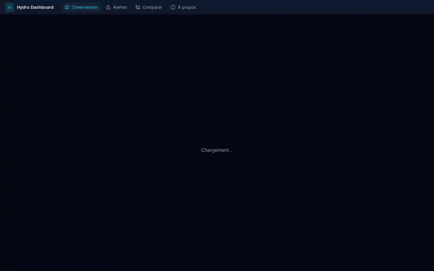

### Interactions avec la carte

- **Clic sur une zone** (région, département, bassin, HER) → zoom sur la zone et filtre spatial les stations contenues

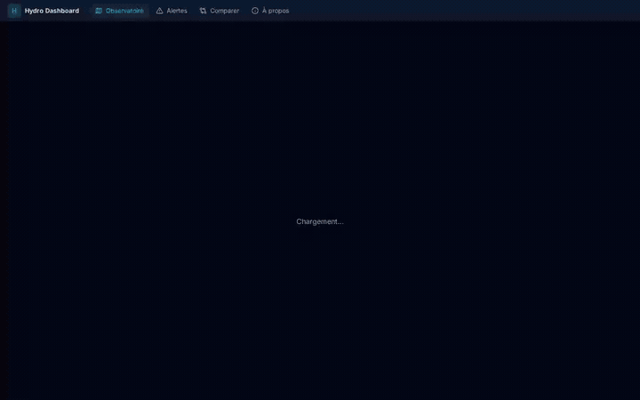

- **Clic sur une station** → ouvre la fiche station dans le volet gauche (voir section suivante)
- **Clic sur le fond vide** → réinitialise le filtre spatial et ferme la fiche station
- **Survol d'une zone** → affiche le nom de la zone en tooltip

### Barre de KPI

La barre en bas de la carte affiche les compteurs de stations :

```
Piézo : 4 250 / 18 500 · Hydro : 1 200 / 5 300
```

Le premier nombre est le nombre de stations filtrées (visibles en couleur), le second est le total.

---

## Panneau de contrôle (volet droit)

### Section « Données »

Active ou désactive l'affichage des types de données :

- **Piézométrie** — stations d'eaux souterraines
- **Hydrométrie** — stations d'eaux de surface
- **Stations filtrées (grises)** — affiche les stations exclues par les filtres (désactivé par défaut)
- **Relief (topographie)** — ombrage du terrain (désactivé par défaut)

### Section « Filtres »

#### Qualité des données (fiabilité)

Trois niveaux de fiabilité basés sur la profondeur historique des données :

| Niveau | Critère | Description |
|---|---|---|
| **Fiables** | >= 10 ans avec >= 6 mois/an | Données suffisantes pour un calcul d'indice robuste |
| **Indicatives** | 5 à 9 ans | Résultat indicatif, historique limité |
| **Insuffisantes** | < 5 ans | Historique trop court pour un calcul fiable |

Par défaut, seules les stations **fiables** sont affichées en couleur. Les stations indicatives et insuffisantes apparaissent en gris (si le toggle est activé). Cocher les cases correspondantes pour les inclure dans les stations colorées.

#### Données année en cours uniquement

Quand cette case est cochée (par défaut), seules les stations ayant reçu au moins une mesure dans l'année en cours sont affichées en couleur. Les stations sans données récentes apparaissent en gris.

**Interaction avec la timeline :** Quand la timeline est active et ce filtre coché, l'« année en cours » est remplacée par l'année de la période timeline. Par exemple, si la timeline est en mars 2014, seules les stations dont la dernière mesure est en 2014 ou après apparaissent en couleur. Les stations qui existaient avant 2014 mais n'ont plus de données apparaissent en gris. Les stations créées après 2014 sont invisibles.

#### Département

Filtrer par code de département INSEE (ex: `75` pour Paris).

#### Classification

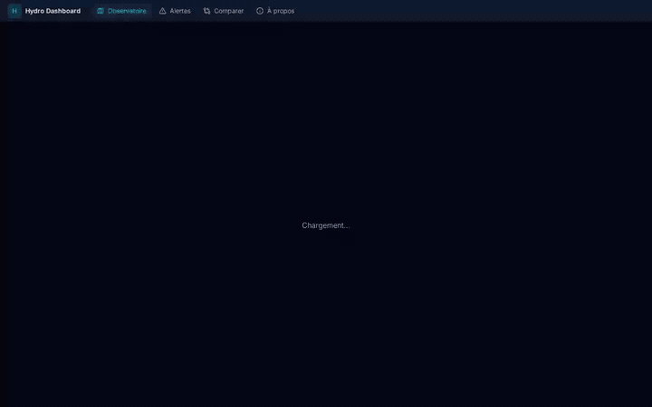

Filtrer par niveau de classification. Cliquer sur un ou plusieurs niveaux pour ne voir que les stations correspondantes. Les boutons sont colorés selon le code couleur standard :

- Extrêmement bas (rouge foncé)
- Très bas (rouge)
- Bas (orange)
- Normal (vert)
- Haut (bleu)
- Très haut (bleu foncé)
- Extrêmement haut (indigo foncé)

#### Observations minimum

Nombre minimum de jours de mesures pour qu'une station soit affichée.

#### Dernière mesure après

Date minimale de la dernière mesure enregistrée.

#### Filtre spatial

Quand un filtre spatial est actif (après avoir cliqué sur une zone), un indicateur apparaît avec un bouton de réinitialisation.

#### Réinitialiser

Le bouton « Réinitialiser » en bas de la section supprime tous les filtres actifs et revient à l'état par défaut.

### Section « Calques »

Permet d'activer/désactiver les calques de fond décrits plus haut. Les calques de zone sont exclusifs (un seul actif à la fois), les calques superposables sont indépendants.

---

## Fiche station (volet gauche)

Un clic sur une station ouvre un volet sur la gauche de la carte avec un résumé.

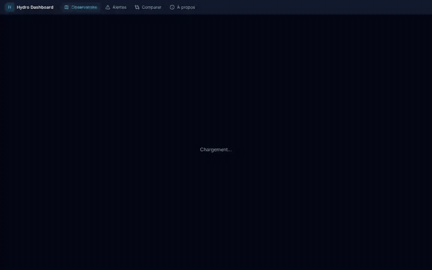

- **En-tête** — nom de la commune, type de station (piézo/hydro), badge de classification coloré
- **Situation actuelle** — classification courante avec couleur
- **Tendance** — icône et label de tendance (hausse forte, hausse significative, stable, baisse significative, baisse forte)
- **Informations** — dernière mesure, nombre de jours/mois de données, département
- **Lien vers le détail** — bouton pour accéder à la page complète de la station

Pour les **stations piézométriques**, le volet affiche aussi les stations voisines rattachées à la même entité BDLISA (même aquifère). Un clic sur une station voisine met à jour le volet.

Pour les **stations hydrométriques**, le volet affiche les stations du même site hydrométrique.

Les stations inactives (pas de données depuis plus de 90 jours) n'affichent pas de volet au clic.

---

## Détail station

La page de détail (`/station/:type/:code`) fournit une analyse complète d'une station individuelle.

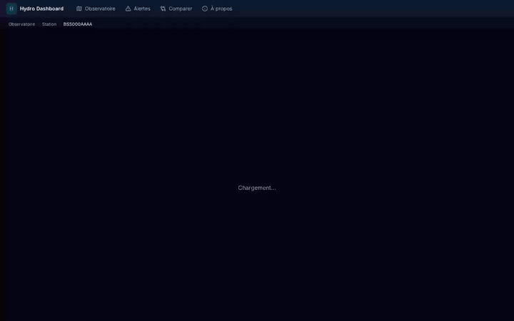

### KPI (indicateurs clés)

Cartes affichant les métriques principales :
- Classification actuelle avec badge coloré
- Tendance (pente de Sen) avec direction
- Dernière mesure (date et valeur)
- Nombre total de jours de mesures

### Graphiques de séries temporelles

Un sélecteur de résolution permet de basculer entre :

| Résolution | Description | Données affichées |
|---|---|---|
| **Journalier** | Mesures brutes jour par jour | Niveau/débit + données ERA5 (température, précipitations, évaporation) |
| **Mensuel** | Agrégats mensuels | Moyenne/min/max + moyennes mobiles 3 mois et 12 mois + variation vs mois précédent et année précédente |
| **Annuel** | Statistiques par année | Moyenne annuelle + percentile historique + classification annuelle |

### Indice de sécheresse

Graphique en barres de l'indice de sécheresse standardisé :
- **SPLI (IPS)** pour les stations piézométriques — Standardized Piezometric Level Index (méthodologie BRGM)
- **SSFI** pour les stations hydrométriques — Standardized Streamflow Index

Les barres sont colorées selon les 7 classes Météo-France. Des bandes de fond indiquent les zones de classification. Une légende en bas du graphique rappelle les seuils.

Un graphique **SPI** (Standardized Precipitation Index) est également affiché pour toutes les stations, permettant de corréler l'état hydrologique avec les précipitations.

### Percentiles historiques

Graphique montrant la position de la valeur annuelle dans la distribution historique (P10, P25, P75, P90).

### Liens externes

- Lien vers la fiche BDLISA de l'entité hydrogéologique (stations piézo)
- Lien vers la fiche SANDRE de la station

---

## Timeline historique

La timeline est un curseur horizontal en bas de la carte qui permet de rejouer l'historique des classifications mois par mois.

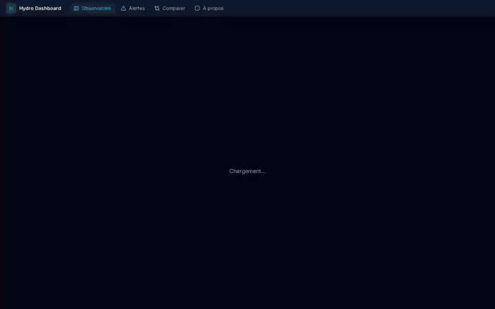

### Utilisation

1. Cliquer sur le bouton play pour lancer la lecture automatique
2. Utiliser le curseur pour naviguer manuellement à une date précise
3. La carte se met à jour en temps réel : chaque station change de couleur en fonction de sa classification à la période sélectionnée

### Contrôles

- **Play / Pause** — lance ou arrête la lecture automatique
- **Vitesse** — préréglages de x0.5 à x10
- **Filtre de saison** — ne lire que certaines saisons (printemps, été, automne, hiver)
- **Filtre d'année** — restreindre la plage d'années

### Comportement des filtres pendant la timeline

Quand la timeline est active, le comportement des filtres est adapté :

| Filtre | Comportement pendant la timeline |
|---|---|
| **Données année en cours** | L'« année en cours » est remplacée par l'année de la période timeline. Les stations dont la dernière mesure est antérieure à l'année timeline apparaissent en gris (si le filtre est coché). Les stations créées après la période timeline sont invisibles. |
| **Classification** | Filtre sur la classification de la période timeline (pas la classification actuelle) |
| **Département / spatial** | Fonctionne normalement |
| **Fiabilité** | Ignorée pendant la timeline |
| **Stations grises** | Les marqueurs gris montrent les stations qui existaient à cette époque mais n'avaient pas de données ce mois-là (uniquement si « Données année en cours » est coché) |

### Détail du comportement des stations grises pendant la timeline

Quand la timeline est active et le filtre « Données année en cours » coché :

- **Station avec des données à la période affichée** → marqueur coloré (classification de l'époque)
- **Station qui existait avant mais n'a plus de données à cette période** → marqueur gris (elle a eu des données dans le passé mais pas à ce mois-là)
- **Station créée après la période affichée** → invisible (n'existait pas encore, aucune donnée antérieure)

---

## Alertes

La page Alertes (`/alerts`) liste les stations actives en situation anormale.

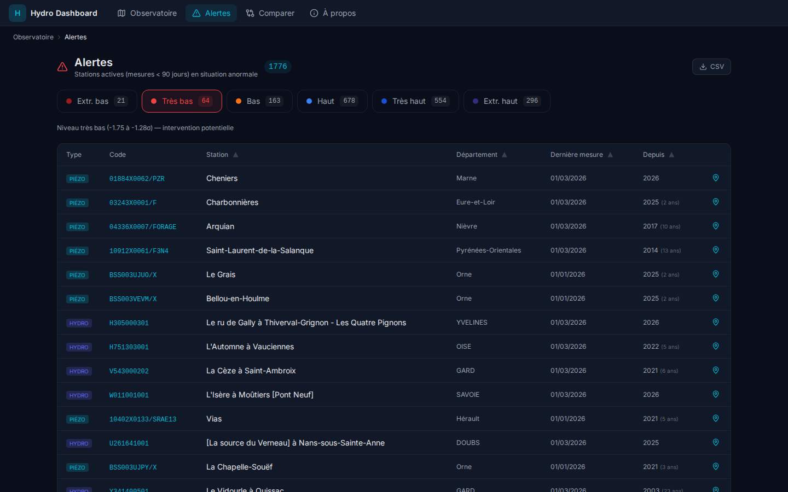

### Critères

Une station apparaît en alerte si :
1. Elle a reçu une mesure dans les **90 derniers jours** (station active)
2. Sa classification actuelle est **anormale** (hors NORMAL)

### Niveaux de sévérité

Les alertes sont organisées par onglets selon la sévérité :

| Onglet | Classification | Signification |
|---|---|---|
| Extrêmement bas | EXTREMEMENT_BAS | Niveau historiquement très critique (< -1.75σ) |
| Très bas | TRES_BAS | Niveau très en dessous de la normale (-1.75 à -1.28σ) |
| Bas | BAS | Niveau en dessous de la normale (-1.28 à -0.84σ) |
| Haut | HAUT | Niveau au-dessus de la normale (0.84 à 1.28σ) |
| Très haut | TRES_HAUT | Niveau très au-dessus de la normale (1.28 à 1.75σ) |
| Extrêmement haut | EXTREMEMENT_HAUT | Niveau historiquement très élevé (> 1.75σ) |

### Durée consécutive

Chaque alerte indique :
- **Alerte depuis** — l'année de début de la situation anormale
- **Années consécutives** — le nombre d'années consécutives dans cette classification

Cela permet d'identifier les stations en situation de sécheresse (ou de crue) prolongée.

### Filtres

- **Type** — piézo, hydro ou les deux
- **Département** — filtrer par département
- **Lien « Voir sur la carte »** — recentre la carte de l'Observatoire sur la station

---

## Comparaison multi-stations

La page Comparer (`/compare`) permet de superposer les séries temporelles de plusieurs stations.

### Fonctionnement

1. Ajouter jusqu'à **5 stations** via la barre de recherche
2. Choisir la **granularité** : journalier ou mensuel
3. Les séries temporelles sont affichées sur le même graphique

### Normalisation z-score

Les stations piézométriques mesurent des niveaux en mètres NGF et les stations hydrométriques des débits en m³/s. Pour rendre les courbes comparables, la plateforme applique une **normalisation z-score** :

```
z = (valeur - moyenne) / écart-type
```

Chaque courbe oscille ainsi autour de 0, avec des amplitudes comparables. Un z-score de +2 signifie que la valeur est à 2 écarts-types au-dessus de la moyenne historique.

---

## Recherche universelle

La barre de recherche en haut à gauche de la carte permet de trouver rapidement n'importe quel élément.

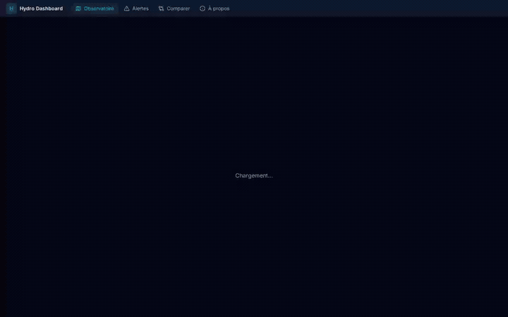

| Catégorie | Exemples de recherche |
|---|---|
| **Stations piézo** | Code BSS, nom de commune |
| **Stations hydro** | Code station, libellé, nom de cours d'eau |
| **Départements** | Code ou nom de département |
| **Régions** | Nom de région |
| **Bassins** | Nom ou code de bassin hydrographique |
| **Hydroécorégions** | Nom de HER |
| **Calques WFS** | Nom de zone/secteur/cours d'eau SANDRE |

La recherche est **insensible aux accents** (rechercher « herault » trouvera « Hérault »).

Un clic sur un résultat :
- Pour une **station** : ouvre la fiche station et centre la carte
- Pour une **zone géographique** : active le calque correspondant, zoome sur la zone, et applique un filtre spatial

---

## Système de classification

### Méthodologie

La classification des stations suit la méthodologie **BRGM RP-64147-FR** et les standards **Météo-France** (Bulletin de Situation Hydrologique, ADES, DREAL). Elle est basée sur des **indices de sécheresse standardisés** calculés mensuellement :

- **SPLI (IPS)** pour les eaux souterraines — Standardized Piezometric Level Index, utilisant une estimation par noyau (KDE) par mois calendaire
- **SSFI** pour les eaux de surface — Standardized Streamflow Index, utilisant un ajustement de distribution gamma par mois calendaire

### Les 7 classes

| Classe | Seuil (σ) | Couleur | Signification |
|---|---|---|---|
| EXTREMEMENT_BAS | < -1.75 | Rouge foncé | Situation exceptionnellement basse, événement rare |
| TRES_BAS | -1.75 à -1.28 | Rouge | Nettement en dessous de la normale |
| BAS | -1.28 à -0.84 | Orange | Modérément en dessous de la normale |
| NORMAL | -0.84 à 0.84 | Vert | Dans la plage de variation habituelle |
| HAUT | 0.84 à 1.28 | Bleu | Modérément au-dessus de la normale |
| TRES_HAUT | 1.28 à 1.75 | Bleu foncé | Nettement au-dessus de la normale |
| EXTREMEMENT_HAUT | > 1.75 | Indigo foncé | Situation exceptionnellement haute, événement rare |

### Calcul

1. Au démarrage du backend, un calcul batch traite toutes les stations (~18 000 piézo, ~5 000 hydro)
2. Pour chaque station, l'indice du dernier mois disponible est calculé
3. L'indice est comparé aux seuils pour obtenir la classe
4. Les résultats sont stockés en cache Redis (24h) et utilisés par tous les endpoints

### Fallback

Si le cache Redis n'est pas disponible, le système se rabat sur la classification percentile stockée en base de données (système à 5 classes, moins précis).

---

## Indices de sécheresse

### SPLI (IPS) — Standardized Piezometric Level Index

Indice standardisé pour les eaux souterraines, développé par le BRGM (rapport RP-64147-FR).

**Méthode :** Pour chaque mois calendaire (janvier, février, ...), la distribution empirique des niveaux piézométriques historiques est estimée par une méthode à noyau (KDE — Kernel Density Estimation). Le niveau du mois courant est positionné dans cette distribution et converti en un z-score (valeur centrée-réduite suivant une loi normale).

**Interprétation :** Un SPLI de -2.0 signifie que le niveau actuel est inférieur à ce qui a été observé historiquement pour ce mois dans ~97.7% des cas.

### SSFI — Standardized Streamflow Index

Indice standardisé pour les eaux de surface (débits des cours d'eau).

**Méthode :** Pour chaque mois calendaire, les débits historiques sont ajustés à une distribution gamma. Le débit du mois courant est transformé en z-score via la CDF (fonction de répartition) de la distribution ajustée.

### SPI — Standardized Precipitation Index

Indice standardisé pour les précipitations, calculé de manière analogue au SSFI (distribution gamma). Affiché sur la page de détail de chaque station pour corréler l'état hydrologique avec les précipitations.

---

## Fiabilité des stations

### Trois niveaux

Le système évalue la **fiabilité** de la classification de chaque station en fonction de la profondeur de son historique :

| Niveau | Critère | Interprétation |
|---|---|---|
| **Fiable** | >= 10 années distinctes avec >= 6 mois de données chacune | L'indice est calculé sur un historique suffisamment long pour être statistiquement robuste |
| **Indicatif** | 5 à 9 années | L'indice donne une tendance mais l'historique est limité — à interpréter avec prudence |
| **Insuffisant** | < 5 années | L'historique est trop court pour un calcul fiable — la classification est peu significative |

### Filtrage

Par défaut, seules les stations **fiables** sont affichées en couleur sur la carte. Les stations indicatives et insuffisantes apparaissent en gris (si activé). Le panneau de contrôle permet d'inclure les niveaux souhaités.

---

## Sources de données

| Source | Organisme | Description | Utilisation dans la plateforme |
|---|---|---|---|
| **Hub'Eau** | BRGM / SCHAPI | API nationale des données piézométriques et hydrométriques | Données des stations, chroniques journalières, niveaux et débits |
| **SANDRE** | EauFrance | Services WFS — zonage hydrographique, réseau Carthage, masses d'eau DCE | 8 calques de carte (zones, cours d'eau, masses d'eau) |
| **ERA5** | ECMWF (Copernicus) | Réanalyse climatique globale | Température, précipitations, évapotranspiration — corrélation avec les niveaux hydrologiques |
| **BDLISA** | BRGM | Base de données des entités hydrogéologiques | Carte des aquifères, rattachement des stations piézo |
| **IGN** | Institut Géographique National | Limites administratives (régions, départements) | Calques de référence sur la carte |
| **AWS Terrain Tiles** | Amazon / Mapzen | Tuiles d'élévation (MNT) | Relief (ombrage de terrain) |

### Fréquence de mise à jour

| Donnée | Fréquence | Détail |
|---|---|---|
| Mesures journalières | Quotidienne | Importées depuis Hub'Eau |
| Agrégats mensuels | Quotidienne (recalcul nocturne) | Calculés à partir des mesures journalières |
| Classifications | Au démarrage du backend | Recalculées à chaque redémarrage, cachées 24h |
| Tendances | Hebdomadaire | Pente de Sen sur l'historique complet |
| Calques WFS (SANDRE) | Rare | Données de référence stables, cache 24h |
| ERA5 | Mensuelle | Réanalyse globale, latence de ~2 mois |
